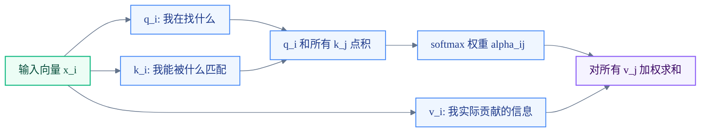
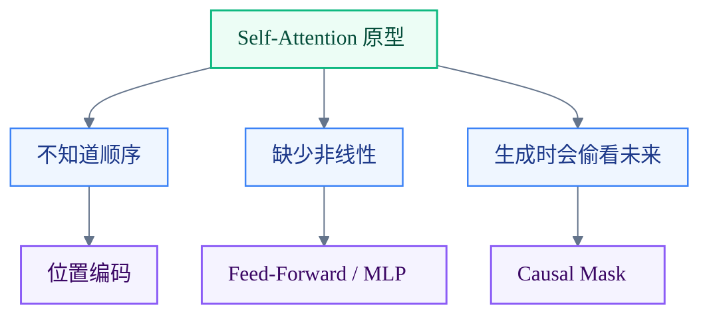
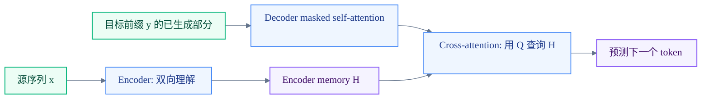
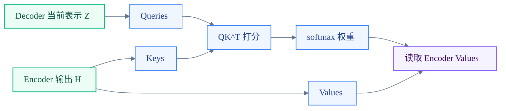
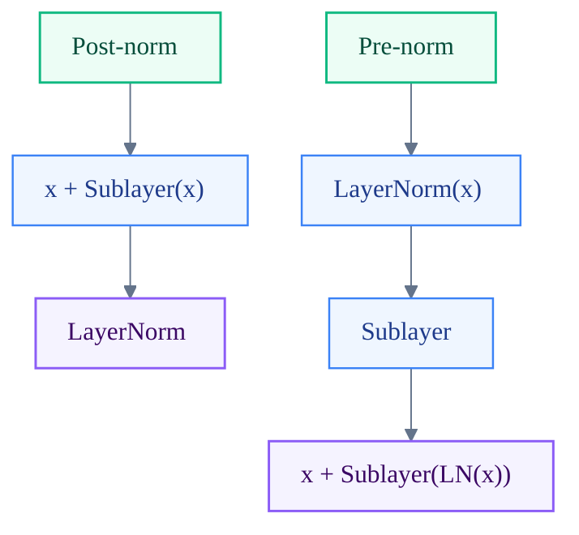

# Lecture 8: Self-Attention and Transformers

### 视觉总览：Transformer 是把序列交互做成矩阵运算

```mermaid
%%{init: {"theme": "base", "flowchart": {"curve": "basis", "nodeSpacing": 34, "rankSpacing": 46, "padding": 10}, "themeVariables": {"fontFamily": "Inter, ui-sans-serif, system-ui, sans-serif", "primaryColor": "#eff6ff", "primaryTextColor": "#172033", "primaryBorderColor": "#3b82f6", "lineColor": "#64748b", "secondaryColor": "#f8fafc", "tertiaryColor": "#fff7ed"}}}%%
flowchart LR
    classDef source fill:#ecfdf5,stroke:#10b981,color:#064e3b,stroke-width:1.5px;
    classDef process fill:#eff6ff,stroke:#3b82f6,color:#1e3a8a,stroke-width:1.25px;
    classDef decision fill:#fff7ed,stroke:#f59e0b,color:#7c2d12,stroke-width:1.5px;
    classDef output fill:#f5f3ff,stroke:#8b5cf6,color:#3b0764,stroke-width:1.5px;
    A["Token embeddings"] --> B["加位置编码"]
    B --> C["Self-Attention"]
    C --> D["Multi-Head"]
    D --> E["Add & Norm"]
    E --> F["Feed-Forward"]
    F --> G["Add & Norm"]
    G --> H["堆叠多个 Block"]

    class A source;
    class B,C,D,E,F,G process;
    class H output;
```



这篇笔记的核心图像是一个 $L\times L$ 的注意力矩阵：每个 token 都能直接给其他 token 打分。Transformer 的并行性、二次方成本、mask 和多头机制，都围绕这张矩阵展开。

### 复习入口：这讲到底在讲什么

这份笔记是根据 CS224N 2025 Lecture 8 选择性整理的。原课件路线是：

1. 从 RNN 过渡到 attention-based model
2. 介绍 Transformer model
3. 展示 Transformer 的效果（本笔记略）
4. 讨论 Transformer 的缺点与变体

三个月后回看时，先按这条主线恢复上下文：

```mermaid
%%{init: {"theme": "base", "flowchart": {"curve": "basis", "nodeSpacing": 34, "rankSpacing": 42, "padding": 10}, "themeVariables": {"fontFamily": "Inter, ui-sans-serif, system-ui, sans-serif", "primaryColor": "#eff6ff", "primaryTextColor": "#172033", "primaryBorderColor": "#3b82f6", "lineColor": "#64748b", "secondaryColor": "#f8fafc", "tertiaryColor": "#fff7ed"}}}%%
flowchart LR
    classDef source fill:#ecfdf5,stroke:#10b981,color:#064e3b,stroke-width:1.5px;
    classDef process fill:#eff6ff,stroke:#3b82f6,color:#1e3a8a,stroke-width:1.25px;
    classDef output fill:#f5f3ff,stroke:#8b5cf6,color:#3b0764,stroke-width:1.5px;

    A["RNN 用 recurrence 传信息"] --> B["Attention 也能传信息"]
    B --> C["去掉 recurrence: Self-Attention"]
    C --> D["补三件事: position / FFN / mask"]
    D --> E["组装 Transformer Block"]
    E --> F["三种使用方式: Encoder / Decoder-only / Encoder-Decoder"]
    F --> G["代价: 训练稳定性 + O(n^2) attention"]

    class A source;
    class B,C,D,E,F process;
    class G output;
```



一个很重要的阅读提醒：课件先讲 **Transformer Decoder**，是因为这一讲正在服务 language modeling。这里的顺序不是说“Transformer 天然先有 decoder”，而是先从自回归生成任务切入，再补充 encoder 和 encoder-decoder。

### 1. From RNNs to Attention-Based NLP models

从抽象的角度看，注意力机制的本质也是一种将序列 $x$ 的信息传递给神经网络输入（如隐藏状态 $h_t$）的方法 。但这恰恰也是 RNN 一直以来的核心使命——传递信息。

那么，既然我们已经有了注意力机制，我们到底还需要循环（Recurrence）吗 ？

既然注意力的信息传递效率更高，那么完全可以直接扔掉 RNN，将注意力机制作为传递信息的更优解 。

#### 自注意力机制

- **交叉注意力 (Cross attention)**：在上一节和作业中实现过，在生成当前词 $y_t$ 时，去关注源语言输入序列 $x$ 的哪些部分 。例如，在法语翻译成英语时，预测 "hit" 时去关注源句子中的 "entarté" 
- **自注意力 (Self attention)**：如果我们抛弃了 RNN，要生成 $y_t$，模型就必须自己关注自己，也就是去关注之前已经生成的序列 $y_{<t}$ 。

更一般地说，self-attention 和 cross-attention 的分界不是“有没有 mask”，而是 **Q/K/V 来自哪里**：

| 注意力类型 | Query 来自 | Key / Value 来自 | 典型用途 |
| --- | --- | --- | --- |
| Self-attention | 当前序列 | 当前序列 | 同一个序列内部交换信息 |
| Masked self-attention | 当前目标序列 | 当前目标序列，但未来位置被遮住 | 语言模型、自回归生成 |
| Cross-attention | Decoder 当前状态 | Encoder 输出 | 翻译、摘要等 seq2seq 任务 |

> PPT 给出的假设性例子："I went to Stanford CS 224n and learned" 。
>
> - 当模型处理到 "learned" 这个词时，它会生成一个查询向量 $q$ 。
> - 其他所有的词都提供了键向量 $k$ 和值向量 $v$ 。
> - 通过计算，"learned" 的注意力权重（Attention weights）在 "Stanford" 和 "CS 224n" 这几个词上最高，说明模型在试图理解 "learned"（学到了什么）时，准确地将注意力放在了课程和学校上 。

#### 自注意力的数学运算过程

假设有一个词汇表 V 中的单词序列 $w_{1:n}$ 。每个词都有一个初始的嵌入向量 $x_i = Ew_i$（其中 $E \in \mathbb{R}^{d \times |V|}$ 是嵌入矩阵） 。 自注意力的计算分三步：

##### 视觉脚手架：每个 token 同时扮演 Query、Key、Value

.png>)



一句话区分三者：Query 用来发问，Key 用来被匹配，Value 是最后真正被混合进输出的信息。

1. **线性映射**：使用三个权重矩阵 $Q, K, V \in \mathbb{R}^{d \times d}$ 对每个词的嵌入向量进行转换，得到查询 $q_i = Qx_i$、键 $k_i = Kx_i$ 和值 $v_i = Vx_i$ 。
2. **计算相似度与归一化**：计算查询和键之间的成对相似度得分 $e_{ij} = q_i^\top k_j$ 。然后使用 softmax 函数进行归一化，得到注意力权重 $\alpha_{ij} = \frac{\exp(e_{ij})}{\sum_{j'} \exp(e_{ij'})}$ 。
3. **加权求和输出**：每个词的最终输出就是值向量的加权求和，公式为 $\sigma_i = \sum_j \alpha_{ij} v_j$ （注意：PPT 这里写成了 $a_{ij}v_i$，实际上是权重与对应词的值向量的乘积求和） 。

#### 自注意力的三大障碍及其解决方案

虽然自注意力机制很强大，但不能直接用它来替代 RNN。

##### 1. 缺乏序列的顺序概念

自注意力在计算时，打乱词的顺序并不会改变最终的加权结果，它本身没有“顺序”的固有概念 。

self-attention 的计算只依赖 token 之间的两两点积与加权求和，本质上对输入是“**置换等变**”的：如果你把输入 token 顺序整体打乱，输出也会按同样方式被打乱；它自己不会凭空知道“谁在前谁在后”。因此必须注入位置信息。

- **解决方案**：引入位置表示（Position representations），将其直接加到输入向量中 。即 $\tilde{x}_i = x_i + p_i$ 

- **位置编码的演进路线**:

  1. **正弦位置编码 (Sinusoids)**：拼接不同周期的正弦和余弦函数，用不同频率的 sin/cos 生成 $p_i$，让人觉得可能能外推到更长序列 。优点是周期性可能有助于推断绝对位置，缺点是不可学习，且对超长序列的外推效果并不好 。

     > **不用学习参数**，也不会固定死最大长度

  2. **绝对位置编码 (Learned Absolute)**：直接学习一个矩阵 $p\in\mathbb{R}^{d\times n}$，每列就是一个位置向量 $p_i$。优点是灵活、拟合能力强；缺点是**不能外推到训练时没见过的长度**（超出 $1..n$ 就没参数）。

     > “绝对位置”解决了“顺序缺失”，但把“最大长度”写死在参数里。
  
  3. 现代方案：RoPE (旋转位置编码)
  
     其实更希望 attention **只依赖相对位置** $i-j$，也就是如果把同样的局部模式平移到句子别处，注意力行为应该类似。
  
     - 正弦会引入一些非纯粹“相对”的交叉项；
     - 绝对位置加法也不天然对应点积结构里的“相对差”。  
  
     RoPE 的核心思想是：**用旋转矩阵把位置信息注入到 Q/K 中，让点积自然地携带相对位置信号**
  
     > 用旋转矩阵编码绝对位置，同时在 self-attention 里体现相对位置依赖

##### 2. 缺乏深度学习所需要的“非线性 ”

单纯的自注意力层里没有任何逐元素（elementwise）的非线性激活函数，只是一堆加权平均操作的叠加 。即使堆叠了多层自注意力，本质上也只是在对值向量重新求平均 。

- **解决方案**：非常简单的修复方法——在每个自注意力模块的输出端，添加一个前馈神经网络（Feed-Forward network, FF）来后处理每个输出向量 
- $m_i = MLP(output_i) = W_2 * \max(0, W_1 output_i + b_1) + b_2$ （引入了 ReLU 非线性激活）

##### 3. **做生成任务时，模型会“偷看”未来的信息**

除了顺序和非线性，如果要用它做机器翻译 decoder 或语言模型，你必须保证在预测第 t 个 token 时**只能用过去信息**，否则训练时模型会作弊（直接看答案）。

在每个 timestep 只把过去 token 当作 keys/queries 来算 attention——但这样会失去并行性，非常低效。  

- **解决方案**：掩码机制（Masking）。为了保持高效的并行计算，我们通过人为地将未来单词的注意力得分（Attention scores）设置为 $-\infty$ 来屏蔽它们 。
- **数学表达**：当 $j > i$（即目标词在当前词的未来）时，令 $e_{ij} = -\infty$ 。这样经过 softmax 后，未来词的权重就会变成 0 。

在解决了这三个障碍后，我们就得到了构建 Transformer 的核心基础模块 。这个 Block 自下而上包含了：

1. **输入与位置编码**：将词嵌入（Embeddings）与位置嵌入（Position Embeddings）相加 。
2. **掩码自注意力 (Masked Self-Attention)**：处理序列的交互，并通过掩码防止信息穿越到过去 。
3. **前馈网络 (Feed-Forward)**：施加在自注意力的输出上，提供必要的非线性表达能力 。

#### 视觉脚手架：三大障碍对应三块补丁



可以把 Transformer block 理解成：attention 负责 token 之间通信，position 负责顺序，MLP 负责非线性变换，mask 负责自回归约束。

---

### 2. Transformer model

如果要做 **language model**（自回归生成），最终都会用到 Transformer decoder。这就是课件为什么先讲 decoder：本讲从“如何用 self-attention 做语言模型”切入，而语言模型需要从左到右预测下一个 token。

Decoder 并不是推倒重来，而是“在刚刚得到的 minimal self-attention 架构上，再加几块关键组件”。其中最先要升级的一块就是：**把单头 self-attention 换成 multi-head self-attention**。

先把几个容易混淆的名字钉住：

| 架构 | Self-attention 可见范围 | 是否有 cross-attention | 典型模型 / 任务 |
| --- | --- | --- | --- |
| Encoder-only | 双向：每个 token 可以看全句 | 没有 | BERT 类理解模型、分类、抽取 |
| Decoder-only | 单向：每个 token 只能看当前位置和过去 | 没有 | GPT 类语言模型、续写、生成 |
| Encoder-Decoder | Encoder 双向；Decoder 单向 | 有，Decoder 读取 Encoder 输出 | 原始 Transformer、T5、翻译、摘要 |

所以，“encoder 和 decoder 是否只差 mask”这个问题要分情况：

- 如果比较 **encoder block** 和 **decoder-only LM block**，主要差别就是 self-attention 有没有 causal mask。
- 如果比较原始 **encoder-decoder Transformer** 里的 encoder block 和 decoder block，decoder 还多一个 **cross-attention** 子层。

#### 多头注意力机制 (Multi-Head Attention)

为什么要在同一个句子里看多个地方？PPT 在第 23 页给出了说明 。

- 对于 "I went to Stanford CS 224n and learned" 这句话，当我们计算 "learned" 的注意力时，**注意力头 1 (Attention head 1)** 可能会专注于寻找“实体”（比如它强烈关注了 "Stanford" 和 "CS"），而 **注意力头 2 (Attention head 2)** 可能会专注于“语法相关的词”（比如关注了代词 "I" 和连词 "and"） 。多头机制让模型能同时从不同的语义维度去解析句子。

- **数学与矩阵堆叠 (Sequence-Stacked form)**：在实际计算中，我们不会一个个词去算，而是将所有的词向量拼接成矩阵 $X=[x_1;\dots;x_n]\in\mathbb{R}^{n\times d}$

  - 第一步，通过一次矩阵乘法 $XQ(XK)^\top$ 直接计算出所有词对之间的注意力得分矩阵 。

  - 第二步，进行 softmax 归一化，然后再乘以 $XV$ 得到加权平均的输出 。

  - $\text{output}=\text{softmax}(XQ\,(XK)^\top)\,XV \in \mathbb{R}^{n\times d}$

    其中 $XQ(XK)^\top\in\mathbb{R}^{n\times n}$ 就是“所有 pair 的注意力分数矩阵”。  

    > 它把在第 6 页学的$o_i=\sum_j \alpha_{ij} v_j$ 提升成一个矩阵表达

- **多头的独立运算与拼接**：定义 $h$ 个不同的注意力头，每个头拥有独立的 $Q_l, K_l, V_l$ 矩阵 。它们独立计算出自己的输出 $output_l$ ，最后将所有头的输出拼接起来，再乘以一个权重矩阵 $Y$ 融合信息 。

  - 如果单头 attention 是用一组 $Q,K,V$ 去投影，那么多头就是用 $\ell=1..h$ 多组投影矩阵 $Q_\ell,K_\ell,V_\ell$ 
  - 每个头独立算：$\text{output}_\ell=\text{softmax}(XQ_\ell (XK_\ell)^\top)\,XV_\ell$
  - 得到每头一个子空间表示（维度约是 $d/h$），最后把所有头拼接/组合，再乘一个输出投影 $Y\in\mathbb{R}^{d\times d}$ 回到 $d$ 维。

  #### 视觉脚手架：多头注意力是多个子空间并行看句子

  .png>)

  ```mermaid
  %%{init: {"theme": "base", "flowchart": {"curve": "basis", "nodeSpacing": 34, "rankSpacing": 46, "padding": 10}, "themeVariables": {"fontFamily": "Inter, ui-sans-serif, system-ui, sans-serif", "primaryColor": "#eff6ff", "primaryTextColor": "#172033", "primaryBorderColor": "#3b82f6", "lineColor": "#64748b", "secondaryColor": "#f8fafc", "tertiaryColor": "#fff7ed"}}}%%
  flowchart LR
      classDef source fill:#ecfdf5,stroke:#10b981,color:#064e3b,stroke-width:1.5px;
      classDef process fill:#eff6ff,stroke:#3b82f6,color:#1e3a8a,stroke-width:1.25px;
      classDef decision fill:#fff7ed,stroke:#f59e0b,color:#7c2d12,stroke-width:1.5px;
      classDef output fill:#f5f3ff,stroke:#8b5cf6,color:#3b0764,stroke-width:1.5px;
      X["同一个输入 X"] --> H1["Head 1"]
      X --> H2["Head 2"]
      X --> H3["Head 3"]
      H1 --> C["Concat"]
      H2 --> C
      H3 --> C
      C --> O["输出投影"]
  
      class X source;
      class H1,H2,H3,C process;
      class O output;
  ```

  每个 head 不是复制完整模型，而是在较小的 $d/h$ 子空间里独立算一次 attention。最后 concat 回 $d$ 维。

- **多头的计算效率**：尽管我们计算 $h$ 次注意力头,但这实际上并不会增加太多成本。**实现上把 head 维 reshape/transpose 成 batch-like 维度**，所以大部分矩阵乘法规模并没有“成倍变大”。

  - 先算 $XQ\in\mathbb{R}^{n\times d}$，再 reshape 成 $\mathbb{R}^{n\times h\times d/h}$；K、V 同理。 

  - 然后 transpose 成 $\mathbb{R}^{h\times n\times d/h}$，让 head 轴“像 batch 一样”。 

    > 可以把它理解成：GPU 不是怕“多头”，GPU 怕的是“很多小矩阵乘法”；而多头 attention 通过 reshape 把它组织成少量大 matmul，效率反而更好。

#### 如何体现并行性

通过**矩阵重塑（Reshape）和转置（Transpose）**，利用 GPU 的批处理（Batching）能力实现了高效并行的计算。

假设我们的输入序列构成的矩阵为 $X \in \mathbb{R}^{n \times d}$（$n$ 是序列长度，$d$ 是词向量维度）。

如果定义 $h$ 个注意力头，模型并不会去创建 $h$ 个维度依然为 $d \times d$ 的庞大矩阵。相反，它会将输入的维度平分给每个头：

- 每一个注意力头 $l$（从 $1$ 到 $h$）都会有自己专属的投影矩阵：$Q_l, K_l, V_l \in \mathbb{R}^{d \times \frac{d}{h}}$ 。
- 这意味着，每个头处理的特征维度实际上从 $d$ 降到了 $d/h$ 。

在实际的代码和底层运算中，多头注意力的计算流程如下：

1. 一次性线性投影 (Joint Linear Projection)

   我们不会写一个 `for` 循环去计算 $h$ 次 $XQ_l$。相反，模型会先做一次完整的大矩阵乘法，计算出包含所有头信息的总查询、总键和总值矩阵：

   - 计算 $XQ \in \mathbb{R}^{n \times d}$ 

   - 计算 $XK \in \mathbb{R}^{n \times d}$ 

   - 计算 $XV \in \mathbb{R}^{n \times d}$ 

2. 重塑与转置 (Reshape and Transpose)

   这是并行计算的魔法所在。为了让这 $h$ 个头互不干扰地独立计算，我们要改变张量的形状：

   - **Reshape**：将 $XQ$ 矩阵从 $\mathbb{R}^{n \times d}$ 重塑为 $\mathbb{R}^{n \times h \times d/h}$ 。

   - **Transpose**：将代表“头”的维度 $h$ 交换到最前面，也就是将张量转置为 $\mathbb{R}^{h \times n \times d/h}$ 。

   - **意义**：做完这一步后，“头”这个维度（$h$）在底层运算库（如 CUDA）眼里，就变成了一个类似“批次（Batch）”的维度 。

   #### 视觉脚手架：reshape 和 transpose 只是在重排视角

   ```text
   原始 Q:       B x L x d
   拆成多头:     B x L x h x d_k
   head 前移:    B x h x L x d_k
   注意力分数:   B x h x L x L
   ```

   这里没有新增语义操作，只是把最后一维 $d$ 拆成 $h$ 个小块，让每个 head 可以并行做 $QK^\top$。

3. 批量矩阵乘法与缩放点积 (Batched Matrix Multiplication & Scaled Dot-Product)

   现在，GPU 会把这 $h$ 个切片当作独立的批次，同时进行矩阵乘法：

   - **计算注意力得分**：执行 $XQ(XK)^\top$ 。经过运算，我们会得到一个形状为 $\mathbb{R}^{h \times n \times n}$ 的张量（在幻灯片的例子中是 3 个头，所以是 $\mathbb{R}^{3 \times n \times n}$） 。这代表所有的注意力分数对。

   - **缩放 (Scale)**：为了防止维度过大导致点积结果极大，进而引起 Softmax 梯度消失，我们需要将得分除以 $\sqrt{d/h}$ 。

   - **Softmax 与加权求和**：沿最后一个维度进行 Softmax 归一化，然后再与 $XV$ 进行批量矩阵乘法，完成加权平均。单个头 $\ell$ 的矩阵表达为：

     $$
     \operatorname{output}_{\ell}
     =
     \operatorname{softmax}\left(
     \frac{(XQ_{\ell})(XK_{\ell})^\top}{\sqrt{d/h}}
     \right)(XV_{\ell})
     $$

     它的输出形状是 $\mathbb{R}^{n\times d/h}$；如果只看某一个 token，对应输出维度是 $\mathbb{R}^{d/h}$。

4. 拼接与最终映射 (Concatenation and Output Projection)

   - **拼接**：将这 $h$ 个头独立计算出的结果按特征维度重新拼接到一起。此时，维度正好恢复成了 $\mathbb{R}^{n \times d}$，公式表示为 $output = [output_1;...;output_h]$ 。

   - **混合信息**：为了让不同头捕捉到的信息能够互相融合，最后会将其乘以一个总的输出权重矩阵 $Y \in \mathbb{R}^{d \times d}$ 。最终输出的维度依然保持为 $\mathbb{R}^{n \times d}$ 。

---

#### 缩放点积 (Scaled Dot Product)

- **问题**：当模型的向量维度 $d$ 变得非常大时，两个向量的点积结果（即未归一化的注意力得分）也会变得非常大 。输入到 softmax 函数的数值过大，会导致其梯度变得极小（即梯度消失），模型将难以训练 。
- **解决方案**：引入“缩放点积”机制 。我们将注意力得分统一除以 $\sqrt{d/h}$（即每个头的维度平方根），防止分数因维度的增加而无限制放大 。
- **公式**： 

  - 先得到

    $Q_l = XW_{Q,l},\quad K_l = XW_{K,l},\quad V_l = XW_{V,l}$
  - 再算

    $\text{Scores}_l = Q_l K_l^\top \in \mathbb{R}^{n\times n}$

  - 最后

    $output_l = \text{softmax}\Big(\frac{Q_l K_l^\top}{\sqrt{d_k}}\Big)V_l$

    其中 $d_k=d/h$。


---

#### 残差连接与层归一化 (Add & Norm) 

在多头注意力之后，Transformer 引入了两个极其重要的优化技巧，它们在架构图中通常被合并写为 **"Add & Norm"** 。

##### 视觉脚手架：Add & Norm 的主干与分支

.png>)


残差连接让原始信息和梯度有一条直接通路；LayerNorm 则把相加后的特征尺度整理稳定。

残差连接的引入是为了解决深度神经网络中极其致命的**梯度消失问题** 。

- **核心理念**：在传统的网络中，每一层都在努力学习一个完整的输入到输出的映射：$X^{(i)} = \text{Layer}(X^{(i-1)})$ 。而残差连接改变了这个思路，它让网络只去学习“输入和输出之间的差值（残差）” 。

- **矩阵层面的数学表达**：

  $$X^{(i)} = X^{(i-1)} + \text{Layer}(X^{(i-1)})$$

  在这里，$X^{(i-1)} \in \mathbb{R}^{n \times d}$ 是上一层的输出矩阵（例如输入的词嵌入矩阵），而 $\text{Layer}(X^{(i-1)})$ 就是经过多头注意力机制（或前馈网络）处理后得到的新矩阵。两者维度完全一致，直接进行矩阵的逐元素相加（Element-wise addition）。

- **为什么它如此有效？**

  1. **梯度为 1 的反向传播**：在反向传播计算导数时，加法操作的局部梯度是 $1$ ！这意味着位于网络深处的误差信号，可以无损地直接穿透残差连接的高速公路，直达网络的浅层，有效防止了梯度在层层反向传播中衰减至零。
  2. **偏向恒等映射**：它天然地为模型提供了一种“偏向于恒等函数（Identity function）”的初始状态 。如果某一层实际上不需要做任何复杂的变换，模型只需要把 $\text{Layer}$ 部分的权重学成 $0$ 即可，这极大地降低了优化难度。

在残差相加之后，矩阵内部的值可能会因为特征的叠加而变得非常大或者波动剧烈。为了帮助模型训练得更快、更稳定，引入了层归一化 。

- **核心理念**：消除隐藏向量值中无信息的波动 。需要特别注意的是，**Layer Norm 是针对序列中的“每一个词向量”独立进行的**，它跨越的是特征维度 $d$。

- **矩阵层面的数学表达**： 假设矩阵中的某一个词向量为 $x \in \mathbb{R}^d$ 。

  1. **计算均值 (Mean)**：在这个向量的 $d$ 个维度上求平均值 $\mu \in \mathbb{R}$ 。

  2. **计算标准差 (Standard Deviation)**：计算这 $d$ 个维度的方差并开根号，得到 $\sigma = \sqrt{\frac{1}{d}\sum_{j=1}^d (x_j - \mu)^2}$，$\sigma \in \mathbb{R}$ 。

  3. **归一化与仿射变换**：

     $$\text{output} = \frac{x - \mu}{\sigma + \epsilon} \circ \gamma + \beta$$

     其中，$\epsilon$ 是一个极小的数，防止分母为 0。$\gamma \in \mathbb{R}^d$（增益参数）和 $\beta \in \mathbb{R}^d$（偏置参数）是模型可以学习的参数 。

- **矩阵视角的作用**：对于形状为 $n \times d$ 的矩阵 $X$，Layer Norm 会对它的每一行（也就是每一个词的 $d$ 维特征）独立进行“减去均值、除以标准差”的操作。这确保了经过多头注意力处理后，无论特征值原本膨胀得有多大，都会被强行拉回一个均值为 0、方差为 1 的标准分布附近，然后再通过可学习的 $\gamma$ 和 $\beta$ 进行微调 。

> 无论现在的语言模型变得多么庞大，其核心的 Transformer Decoder Block 依然没有脱离这个最基础的四步循环：
>
> - **步骤 1**：**Masked Multi-Head Attention**（提取当前词与历史文本的交互特征，同时利用掩码防止偷看未来）。
> - **步骤 2**：**Add & Norm**（通过残差和归一化稳定注意力层的输出）。
> - **步骤 3**：**Feed-Forward**（通过前馈网络引入至关重要的非线性表达能力）。
> - **步骤 4**：**Add & Norm**（再次稳定前馈网络的输出）。

#### Encoder 与 Decoder 的差异 

先区分两个语境里的 decoder：

1. **Decoder-only language model 的 decoder block**：用于 GPT 类模型。每层通常是 masked multi-head self-attention $\rightarrow$ Add & Norm $\rightarrow$ FFN $\rightarrow$ Add & Norm。
2. **Encoder-decoder Transformer 里的 decoder block**：用于翻译、摘要等 seq2seq。每层通常是 masked self-attention $\rightarrow$ cross-attention $\rightarrow$ FFN，中间各自配 Add & Norm。

因此，Encoder 和 Decoder 的关系可以这样记：

- **Transformer Encoder (编码器)**：去掉 causal mask，让每个 token 可以看整条输入序列。它适合做“理解输入”的双向上下文表示。
- **Decoder-only Transformer**：保留 causal mask，让第 $t$ 个位置只能看 $y_{\le t}$。它适合做“预测下一个 token”的自回归语言模型。
- **Encoder-Decoder Transformer 的 Decoder**：既要用 causal mask 看目标前缀，又要通过 cross-attention 读取 encoder 输出。它适合做“看着输入序列生成输出序列”的任务。

##### 视觉脚手架：Encoder 看全句，Decoder 只能看过去

.png>)

这张图是复习 encoder/decoder 时最值得先看的图：左边抓住 encoder 的“全句可见”，右边抓住 decoder 的“过去可见 + seq2seq 时额外 cross-attention”。注意图里的 cross-attention 只属于 encoder-decoder 场景；GPT 式 decoder-only 模型没有这一层。

```text
Encoder self-attention:
token i 可以看所有 j

Decoder masked self-attention:
token i 只能看 j <= i
```

一个小的 causal mask 可以这样想：

| query \\ key | 1 | 2 | 3 | 4 |
| --- | --- | --- | --- | --- |
| 1 | 可看 | 遮住 | 遮住 | 遮住 |
| 2 | 可看 | 可看 | 遮住 | 遮住 |
| 3 | 可看 | 可看 | 可看 | 遮住 |
| 4 | 可看 | 可看 | 可看 | 可看 |

#### Encoder-Decoder 架构与交叉注意力 

对于像机器翻译这样的序列到序列（seq2seq）任务，我们需要把 Encoder 和 Decoder 结合起来 。

整体匹配关系不是“第 $i$ 层 encoder 必须对应第 $i$ 层 decoder”，而是：encoder 先把源序列变成一组可查询的记忆 $H$，decoder 在每一层生成目标序列表示时，都可以通过 cross-attention 读取这组记忆。



##### 视觉脚手架：Cross-Attention 的 Q 来自 Decoder，K/V 来自 Encoder



self-attention 是同一个序列内部互看；cross-attention 是 decoder 带着 Query 去 encoder 的记忆库里查信息。

- **架构交互**：我们先用 Transformer Encoder 处理源语言句子（获取双向信息） 。然后，使用 Transformer Decoder 来一步步生成目标语言句子 。
- **交叉注意力 (Cross-attention)**：在 Decoder 内部，除了普通的掩码自注意力层之外，还增加了一个特殊的注意力层，专门用来“看” Encoder 的输出 。
  - **信息的来源不同**：在这里，**键 (Keys) 和 值 (Values)** 来自于 Encoder 的输出向量 $H$（你可以把它想象成一个包含了源语言信息的“记忆库”） 。
  - **谁在提问**：而 **查询 (Queries)** 来自于 Decoder 当前的处理状态 $Z$ 。
  - **矩阵运算**：其核心矩阵运算变成了 $\text{output} = \text{softmax}(ZQ(HK)^\top) \times HV$ 。这意味着解码器在生成每个新词时，都在动态地查询源句子中对当前生成最有用的部分。

---

### 3. Great results with Transformers（本笔记略）

原课件这里用机器翻译、文档生成和预训练结果说明 Transformer 的效果很好，而且因为并行性强，逐渐成为 NLP 的主流架构。本笔记主要关注机制理解，所以这一节只保留结论：

> Transformer 重要，不只是因为效果好，还因为它把序列建模改造成了大规模矩阵运算，因此特别适合 GPU 并行训练和预训练。

---

### 4. Drawbacks and variants of Transformers

1. **Training instabilities（训练不稳定）**：尤其指一个很具体、很工程化的细节——**LayerNorm 是放在子层之前（Pre-norm）还是之后（Post-norm）**。这看似只是画图位置不同，但会显著影响深层 Transformer 的梯度流动与可训练性。

2. **Quadratic compute in self-attention（二次方计算）**：Self-attention 的核心是“每个 token 都要和其他 token 交互一次”，于是复杂度随序列长度 **n** 变成 **O(n²)**；而 RNN 这种递归结构，长度只会线性增长 **O(n)**。这也是 Transformer 做长上下文时最硬的瓶颈之一。

#### Pre-norm vs Post-norm

*" The one thing everyone agrees on (in 2024)”* ——也就是说，在 2024 年的工程实践里，这件事几乎成了共识。

##### 视觉脚手架：Pre-norm 把 LayerNorm 放到分支里



关键直觉：Post-norm 会让 LayerNorm 直接作用在残差主干上；Pre-norm 让主干更接近恒等路径，因此深层训练通常更稳。

1. 先抓住“残差主干（residual stream）”

   Transformer block 的核心是：输入 **x** 走一条“主干”向上流动（残差连接），旁边挂着两个“分支模块”：

   - Multi-Head Attention 分支

   - FFN 分支

   训练是否稳定，很大程度取决于：**主干上信息与梯度能不能顺畅、近似恒等地通过很多层**。

2. Post-norm：先做子层 + 残差相加，再 LayerNorm

   典型形式像：

$$
x \leftarrow \text{LN}(x + \text{Sublayer}(x))
$$

   直觉：LayerNorm 会直接作用在 “$x + \text{Sublayer}(x)$” 上，**也就会影响残差主干的信号尺度与梯度尺度**。层数一深，训练更容易出现不稳定（比如梯度衰减/爆炸、loss 抖动等），尤其在大模型/深层时更明显。

3. Pre-norm：先 LayerNorm，再进子层，然后做残差相加

   典型形式像：

$$
x \leftarrow x + \text{Sublayer}(\text{LN}(x))
$$

   直觉：**LayerNorm 被“挪到分支里”**，更像是在“喂给子层之前把输入整理好”，但残差主干那条 **x → x + ...** 的路径更接近“干净的恒等映射”。这会让深层网络的梯度更容易沿主干传播，因此更稳。

   PPT 结论：**“Set up LayerNorm so that it doesn’t affect the main residual signal path”**，并强调 **“Almost all modern LMs use pre-norm（但 BERT 是 post-norm）”**。

   你可以把它理解成一句工程经验：**想把 Transformer 堆得很深、训得很大，优先让残差主干尽量“少被打扰”。**

#### 自注意力的二次方计算成本

self-attention 的优点之一是高度并行（所有 token 可以一起算），但它的核心计算是：**要算出一个 $n\times n$ 的注意力分数矩阵**（每个 i 对每个 j 的相似度）。要形成
$$
XQK^\top X^\top \in \mathbb{R}^{n \times n}
$$
不必纠结它写法细节，关键是：**会出现一个 n×n 的“全对全交互表”**，于是计算/显存都绕不开 n²。

##### 视觉脚手架：注意力矩阵是全对全表

```text
        key1 key2 key3 ... keyn
query1   *    *    *        *
query2   *    *    *        *
query3   *    *    *        *
 ...     *    *    *        *
queryn   *    *    *        *

共有 n x n 个分数
```

这张表就是 Transformer 长上下文贵的源头：序列长度翻倍，分数表大约变成四倍。

- 句子级：$n \le 30$，那 $n^2 \le 900$，完全不疼。
- 实务里常见上限：$n=512$（经典 Transformer/BERT 时代的常见窗口）。
- 但如果想做长文档：**$n \ge 50,000$**，那 $n^2$ 直接变成天文数字，计算/显存都会非常难扛。

> Transformer 的“长上下文难题”不是模型不会理解长文，而是 **全对全交互让成本随长度平方爆炸**。

如果真的想要“超长上下文”，**递归/状态空间类模型的线性复杂度有天然优势**。**RWKV、Mamba** 等“现代 RNN/状态空间风格模型”在变强。当“上下文长度”成了第一矛盾时，**大家又开始重新重视线性时间的序列建模**（不一定回到传统 RNN，而是更现代的“递归/状态空间”范式）。

##### 我们真的需要“去掉二次方注意力”吗？

1. **模型越大，计算大头越来越不在 attention 上**
    很多大模型里，FFN/MLP、embedding、输出层、以及各种工程开销会占据越来越大的比例；所以你把 attention 从 O(n²) 改成 O(n) 并不一定带来“整体训练成本”的同等比例下降。

2. **生产系统里，很多模型仍然用二次方注意力**
    PPT 直接说：生产级 Transformer LMs 仍在用 quadratic attention。
    原因很朴素：很多“更便宜的注意力近似/替代”在大规模训练下效果不够好。

3. **系统优化往往更划算**
    与其改模型结构，不如把同样的计算做得更快。PPT 点名了 **FlashAttention（Jun 2022）** 这种系统级优化“works well”。

---

### Appendix A: Attention 公式与维度推导

这一节不是 `Drawbacks and variants` 的补充，而是对前面 self-attention、cross-attention 和 multi-head attention 的数学补强。复习公式时看这里，复习模型结构时回到第 2 节。

这里主要推导：self-attention 矩阵式和 cross-attention 矩阵式的 **维度对齐**、**为什么要转置 K**、以及 **multi-head 的 reshape/transpose 为什么等价**。

- **B**：batch size
- **L**：序列长度（self-attn 时就是同一个序列长度；cross-attn 时 decoder 长度记为 **T**，encoder 长度记为 **S**）
- **d**：model hidden size（d_model）
- **h**：头数（num_heads）
- **d_k = d/h**：每个头的维度（head_dim）

------

#### **Self-Attention 的矩阵形式（维度严格对齐）**

PPT 第 24 页把 token 级公式写成矩阵式：把序列堆成矩阵 X，然后做$ \mathrm{softmax}(XQ (XK)^\top)\,XV$。 

##### 视觉脚手架：矩阵乘法的形状闭环

```text
X        : L x d
Q = XW_Q : L x d
K = XW_K : L x d
V = XW_V : L x d

QK^T     : (L x d)(d x L) = L x L
softmax  : L x L
A V      : (L x L)(L x d) = L x d
```

最后输出仍然是 $L\times d$，所以它可以继续喂给下一层 Transformer block。

1. 从 token 级到矩阵级：每一步的形状

- 输入

  把每个 token 向量 $x_i\in\mathbb{R}^{d}$ 堆起来：$X\in\mathbb{R}^{L\times d}$（如果带 batch：$X\in\mathbb{R}^{B\times L\times d}$）

2. 线性投影得到 Q/K/V

   PPT 用 $XQ$, $XK$, $XV$ 表示（它这里把投影矩阵也记成 $Q/K/V$；有些教材写成 $W_Q$,$W_K$,$W_V$，只是记号不同）。 

   令$W_Q,W_K,W_V\in\mathbb{R}^{d\times d}$

   则$Q = XW_Q \in\mathbb{R}^{L\times d},\quad K = XW_K \in\mathbb{R}^{L\times d},\quad V = XW_V \in\mathbb{R}^{L\times d}$

   （带 batch：$Q,K,V\in\mathbb{R}^{B\times L\times d}$）

3. 为什么一定要转置 K？

   注意力得分矩阵要长成 “**每个 query 位置 i 对所有 key 位置 j 的分数**”，所以它应当是一个$ L\times L$ 的矩阵。

   我们要做：$\text{Scores}=QK^\top$

   - 若不转置：$QK$ 是 ($L\times d)(L\times d$) —— 内维对不上，根本乘不了。


   - 转置后：$(L\times d)(d\times L)=(L\times L)$，得到所有 pair 的打分矩阵。

     这点很多教程会特别强调 “K 必须 transpose 才能得到 ($\text{seq},\text{seq}$) 的注意力矩阵”。 

   带 batch 时，转的是最后两维：$\text{Scores}=QK^{\top}\in\mathbb{R}^{B\times L\times L}$（实现里就是 $K.transpose(-2,-1)$）

4. softmax 归一化与输出

   对 Scores 的 **最后一维**（也就是对每个 i，沿着 j）做 softmax，得到权重矩阵：

   $A=\mathrm{softmax}(\text{Scores})\in\mathbb{R}^{B\times L\times L}$

   然后

   $O = AV \in \mathbb{R}^{B\times L\times d}$

   这就是 PPT 第 24 页那句 “$\mathrm{softmax}(XQ (XK)^\top) XV$” 的完整形状闭环。

   PPT 第 35 页写的是 encoder-decoder attention（cross-attention）：$\mathrm{softmax}(ZQ (HK)^\top)\,HV$

   其中 Z 来自 decoder，H 来自 encoder。 这和经典 Transformer 解释一致：decoder 的 queries 去对齐 encoder 都能“读”整条源序列记忆。 

#### 维度对齐（带 batch）

输入:

- Encoder 输出：$H\in\mathbb{R}^{B\times S\times d}$
- Decoder 当前层表示：$Z\in\mathbb{R}^{B\times T\times d}$

投影:

- $Q_d = ZW_Q \in\mathbb{R}^{B\times T\times d}$

- $K_e = HW_K \in\mathbb{R}^{B\times S\times d},\quad V_e = HW_V \in\mathbb{R}^{B\times S\times d}$

**得分矩阵（这里再次解释为什么要转置 K）**

我们需要的是：**对每个 decoder 位置 t，给所有 encoder 位置 s 打分**

- 得分矩阵应是 $T\times S$：

  $\text{Scores}=Q_d K_e^\top$

- 形状：

  $(B\times T\times d)\ \cdot\ (B\times d\times S)\ =\ B\times T\times S$

所以 $K_e$ 同样要在最后两维转置，才能把 encoder 的 S 维摆到最后一维。 

#### **权重与输出**

- $A=\mathrm{softmax}(\text{Scores})\in\mathbb{R}^{B\times T\times S}$

- $O = A V_e \in\mathbb{R}^{B\times T\times d}$

> self-attention 是 $ L\times L$（同一序列内部）；
>
> cross-attention 是 $T\times S$（decoder 每个位置去看 encoder 全序列）。

------

#### 为什么 “reshape/transpose” 与“逐头分别算”完全等价？

PPT 第 26 页强调：实现上通过 reshape/transpose 把 head 维度组织起来，并不会改变数学本质。 

很多实现教程也会写出同样的标准形状变换：先 reshape 分离 heads，再 transpose 把 head 维提前，以便并行计算每个头的 $QK^\top$。 

##### 两种观点：分头线性层 vs 一次性大线性层

1. **观点 A：每个头各自一套投影** 

   - $Q^{(\ell)} = XW_Q^{(\ell)},\quad$

   - $K^{(\ell)} = XW_K^{(\ell)},\quad$

   - $V^{(\ell)} = XW_V^{(\ell)}$

   其中 $W_Q^{(\ell)}\in\mathbb{R}^{d\times d_k}$。

   然后每头输出：$O^{(\ell)}=\mathrm{softmax}\!\Big(\frac{Q^{(\ell)} {K^{(\ell)}}^\top}{\sqrt{d_k}}\Big) V^{(\ell)}$

   最后把各头 concat 再投影回 d。这个就是 “multi-head attention 的定义式”。 

2. **观点 B：一次性投影到 d，再 reshape 切成 h 个头**

   很多库为了效率不会循环 h 次线性层，而是用一个大矩阵：$W_Q\in\mathbb{R}^{d\times d}\quad(\text{其中 }d=h\cdot d_k)$

   算出$Q = XW_Q \in\mathbb{R}^{B\times L\times d}$

   然后把最后一维 d **重解释**为 ($h, d_k$)：$Q \ \text{reshape}\ \to\ Q'\in\mathbb{R}^{B\times L\times h\times d_k}$

   - 关键点：**这一步不是“近似”，而是纯粹的索引重排**。
   - 可以把它写成严格等式（这是“等价”的核心）：$Q'[b, i, \ell, r] \equiv Q[b, i, \ell\cdot d_k + r]$

   也就是说：第 $\ell$ 个头拿到的那段 $d_k$ 维子向量，就是原来 d 维向量里连续的一段（当然也可以是更一般的分块布局；实现通常就是分块）。

   如果把 W_Q 写成按头分块拼接：$W_Q = [W_Q^{(1)}\ |\ W_Q^{(2)}\ |\ \cdots\ |\ W_Q^{(h)}]$

   那么一次性投影 $XW_Q$ 得到的 d 维结果，按块拆开就**恰好**是每个头各自的 $XW_Q^{(\ell)}$。

   所以 “一次性大线性层 + reshape” 与 “h 个小线性层” 在数学上完全一致，只是实现更高效。

##### 为什么还要 transpose？

reshape 后通常会做：

$(B,L,h,d_k)\ \xrightarrow{\ \text{transpose}\ }\ (B,h,L,d_k)$

原因不是数学需要，而是**为了让后面的 batched matmul 更自然**：

- 我们要算每个头的 $QK^\top$，希望把 head 当作一个批次维度一起算。

- 于是把维度排成 $(B,h,L,d_k)$ 和 $(B,h,S,d_k)$，再对最后两维做矩阵乘，直接得到：

  $\text{Scores}\in\mathbb{R}^{B\times h\times L\times S}$

这正是很多实现/教程写的标准张量形状。 

> transpose 的本质：仍然是索引重排，不改数值；
>
> 它的作用是让你能用一次 batched matmul 并行算完所有 heads 的注意力矩阵。

##### 把多头输出拼回 d（concat）

每头输出：

$O'\in\mathbb{R}^{B\times h\times L\times d_k}$

先 transpose 回 $(B,L,h,d_k)$，再 reshape 合并 heads：$(B,L,h,d_k)\ \to\ (B,L,hd_k)=(B,L,d)$

这就是 “concat heads”。很多实现会提醒 transpose 后要 .contiguous() 再 view/reshape，因为内存布局变了，但数学上仍是同一个张量重排。 

---

1. **第 24 页 self-attention**：

   $O=\mathrm{softmax}(QK^\top)V$

   其中转置 $K^\top$ 是为了让 $(L\times d)(d\times L)\to(L\times L)$。  

2. **第 35 页 cross-attention**：

   $O=\mathrm{softmax}(Q_dK_e^\top)V_e$

   输出长度跟 decoder 一样是 T，但注意力矩阵是 $T\times S$。  

3. **multi-head 的 reshape/transpose 等价性**：

- reshape 是把 $d=h\cdot d_k$ 的最后一维拆成 $(h,d_k)$，本质是索引重解释；
- transpose 只是把 head 维提前，方便 batched matmul 并行算所有头；
- 全程不改数学，只改计算组织方式。  
