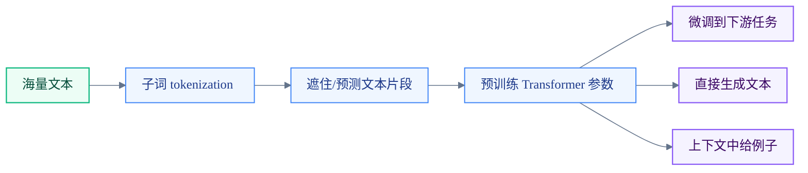
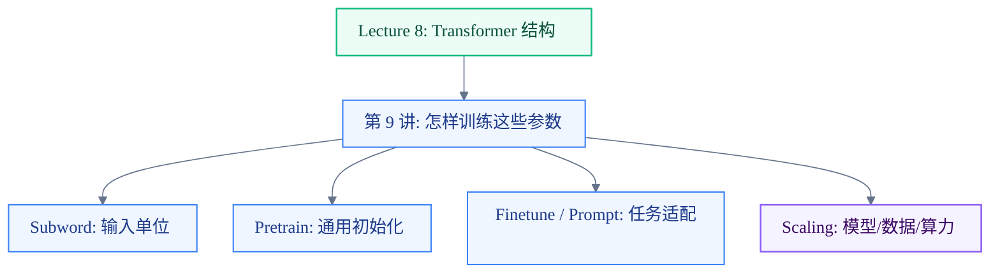
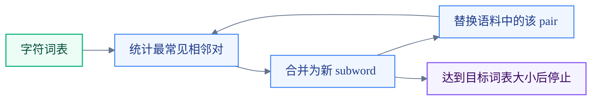

# Lecture Note 9: Pretraining

### 主要内容

- 为什么 NLP 从“预训练词向量”走向“预训练整个模型”
- 子词建模：为什么现代模型不用纯 word-level vocabulary，以及 BPE 的基本算法
- 预训练 / 微调范式：先用海量无标注文本学通用语言能力，再用少量标注数据适配任务
- 三类 Transformer 架构的预训练方式：Encoder/BERT、Encoder-Decoder/T5、Decoder/GPT
- 大模型的 in-context learning 和 scaling laws：为什么规模、数据、计算预算变成核心变量

---

### 视觉总览：第 9 讲是在回答“Transformer 学什么”



如果 Lecture 8 的重点是 **Transformer block 怎么算**，Lecture 9 的重点就是：我们如何设计一个无需人工标注、可以吃下互联网规模文本的训练任务，让 Transformer 的大部分参数先学到语言结构、世界知识和可迁移的初始化。

一句话主线：

> 预训练把“语言本身”变成监督信号：遮住一部分文本，或只给过去文本，让模型重建缺失内容。

---

### 复习入口：从手写 Transformer 接到预训练

你已经手写过 Transformer 后，可以把这节课看成四个问题：

1. **输入怎么表示？**  
   不能只用 word-level vocabulary，否则新词、拼写变化、罕见词都会掉进 `UNK`。所以现代模型用 subword tokens。

2. **训练信号从哪里来？**  
   下游任务标注太少，互联网文本太多。预训练任务要尽量不依赖人工标签。

3. **不同架构怎么预训练？**  
   Encoder、Decoder、Encoder-Decoder 的可见信息不同，所以目标函数也不同。

4. **为什么越大越强？**  
   规模带来更好的 perplexity 和迁移能力，但模型大小、训练 token 数、计算预算之间有 tradeoff。



---

## 1. 为什么需要预训练

早期 NLP 常见路线是：

1. 用 word2vec/GloVe 之类方法预训练 **词向量**；
2. 下游任务里随机初始化 LSTM/Transformer 的其他参数；
3. 用任务数据训练上下文建模能力。

问题在于：词向量本身没有上下文。同一个词 `record` 在不同句子里可能是名词，也可能是动词；如果只给它同一个 embedding，真正的语义区分就必须由下游任务数据重新学。

这对下游任务很苛刻：

- 标注数据通常很少，比如 QA、情感分类、自然语言推理；
- 但上下文语义、语法、指代、常识、长距离依赖都很复杂；
- 网络中大部分参数随机初始化，等于每个任务都要从头学很多语言知识。

现代预训练的转变是：

> 不只预训练词向量，而是预训练整个模型的大部分参数。

也就是说，Transformer 的 embedding、attention、MLP、LayerNorm、输出头等参数，都可以先通过通用文本任务学习，再迁移到具体任务。

---

## 2. Subword Modeling：解决词表和未知词问题

### 2.1 word-level vocabulary 的问题

如果词表只由训练集里的完整单词组成，那么测试时遇到新词会被映射成同一个 `UNK`：

| 输入词 | word-level 处理的问题 |
| --- | --- |
| `hat` | 常见词，可以查表 |
| `learn` | 常见词，可以查表 |
| `taaaaasty` | 变体拼写，可能变成 `UNK` |
| `laern` | 拼写错误，可能变成 `UNK` |
| `Transformerify` | 新造词，可能变成 `UNK` |

这会丢掉很多有用结构。比如 `Transformerify` 至少包含 `Transformer` 和类似动词化/派生的后缀信息，直接变成 `UNK` 太粗暴。

### 2.2 BPE 的直觉

Subword modeling 的目标是：不用纯字符，也不用纯单词，而是学习一套“常见词片段”词表。

- 常见词可以整体成为 token；
- 罕见词拆成若干片段；
- 最坏情况可以退回到字符级别，因此大幅减少 `UNK`。

Byte-Pair Encoding, BPE 的核心算法：

1. 初始词表只有字符和词尾符号；
2. 在语料里找到最常见的相邻 token 对，比如 `a,b`；
3. 把它们合并成新 token `ab`；
4. 重复合并，直到达到目标词表大小。



一个直观结果：

| 词 | subword 处理 |
| --- | --- |
| `hat` | `hat` |
| `learn` | `learn` |
| `taaaaasty` | 可能拆成 `taa ##aaa ##sty` |
| `laern` | 可能拆成 `la ##ern` |
| `Transformerify` | 可能拆成 `Transformer ##ify` |

这里的具体拆法取决于训练语料和 tokenizer 规则，不要把课件里的拆法当作唯一答案。

---

## 3. 从词向量预训练到整模型预训练

### 3.1 词向量预训练学到什么

word2vec/GloVe 背后的分布式语义思想是：词的意义和它出现的上下文有关。这个思想非常重要，但早期词向量有一个硬限制：

> 每个词类型只有一个向量，不管它出现在什么句子里。

所以 `record` 在 `I record the record` 里出现两次，两个位置的语义不同，但静态词向量给出的初始表示相同。

### 3.2 整模型预训练学到什么

预训练整个 Transformer 后，模型学的不是孤立词表，而是上下文函数：

$$
h_1,\ldots,h_T = \mathrm{Transformer}(w_1,\ldots,w_T)
$$

每个位置的表示 $h_i$ 都由整句上下文决定。这样模型可以在预训练阶段就练习很多能力：

- 地理和事实知识：`Stanford University is located in ___, California.`
- 冠词和句法：`I put ___ fork down on the table.`
- 指代消解：`The woman ... over ___ shoulder.`
- 语义类别补全：`fish, turtles, seals, and ___.`
- 情感/评价：`The movie was ___.`
- 跨句实体跟踪：Iroh/Zuko 的例子
- 简单序列规律：`1, 1, 2, 3, 5, 8, ...`

注意这里不等于模型真正理解了所有东西，但这些 fill-in-the-blank 风格任务确实给了模型极其丰富的弱监督信号。

---

## 4. Pretraining / Finetuning Paradigm

预训练 / 微调可以看成两阶段优化：

1. 预训练得到参数：

   $$
   \hat{\theta} \approx \arg\min_\theta \mathcal{L}_{pretrain}(\theta)
   $$

2. 微调时从 $\hat{\theta}$ 出发，优化下游任务：

   $$
   \theta^* \approx \arg\min_\theta \mathcal{L}_{finetune}(\theta)
   $$

从神经网络优化角度看，预训练可能有两层帮助：

- **初始化更好**：SGD 微调时通常不会离初始点太远，因此 $\hat{\theta}$ 附近的好解更容易被找到；
- **梯度传播更顺**：预训练后的参数区域可能让下游 loss 的梯度更稳定、更有用。


这就是课件里的口号：

> Pretrain once, finetune many times.

---

## 5. 为什么是无监督文本，而不是直接预训练 QA

原因很现实：数据规模差得太多。

课件给的数量级对比：

| 数据来源 | token 数量级 |
| --- | ---: |
| SQuAD 2.0 | 小于 50M |
| DCLM-pool | 240T |
| indexed internet text | 约 510T |
| total internet text 估计 | 约 3100T |

也就是说，QA 标注数据和互联网文本之间有千万倍级别差距。预训练要利用这个规模优势，就不能依赖人工标注。

同时，互联网文本不仅数量大，而且类型极其多样：

- 百科/粉丝 Wiki；
- 博客和评论；
- 面试题、教程、技术文档；
- 小说、书籍、论坛；
- 新闻、问答、网页碎片。

这种多样性让模型对大量下游任务获得“弱覆盖”。但这里也有重要伦理和法律问题：语料来源、版权、fair use、隐私、数据质量和偏见都不是小问题。课件提到 BookCorpus 等数据集时，也指出这类互联网抓取书籍语料具有争议性。

---

## 6. 三种架构，三种预训练方式

Transformer 架构会决定模型能看见什么信息，因此也决定了适合的预训练目标。

| 架构 | 注意力可见范围 | 典型预训练目标 | 代表模型 | 擅长任务 |
| --- | --- | --- | --- | --- |
| Encoder-only | 双向上下文 | Masked LM | BERT/RoBERTa/SpanBERT | 分类、抽取、匹配、理解 |
| Encoder-Decoder | Encoder 双向，Decoder 自回归 | Span corruption / denoising | T5 | 文本到文本任务、摘要、翻译、QA |
| Decoder-only | 只能看过去 | Language modeling | GPT/GPT-2/GPT-3 | 生成、对话、续写、in-context learning |

### 6.1 Encoder-only：BERT 和 Masked Language Modeling

Encoder 的优势是能同时看左右上下文：

$$
h_1,\ldots,h_T = Encoder(w_1,\ldots,w_T)
$$

但这也带来问题：如果直接做从左到右语言模型，encoder 会看到未来 token，相当于作弊。

所以 BERT 使用 **Masked Language Modeling, MLM**：

1. 随机选中一部分 token；
2. 把输入改成带 mask 或扰动的版本 $\tilde{x}$；
3. 只在被选中的位置上计算预测 loss；
4. 训练模型近似重建 $p_\theta(x \mid \tilde{x})$。


BERT 的 MLM 细节：

- 随机预测 15% 的 subword tokens；
- 被选中的 token 中：
  - 80% 替换成 `[MASK]`；
  - 10% 替换成随机 token；
  - 10% 保持原样，但仍然要求模型预测它；
- 这样做是因为微调时不会出现 `[MASK]`，模型不能只学会“看到 mask 才认真建模”。

BERT 还用了 **Next Sentence Prediction, NSP**：输入两段文本，预测第二段是否真实跟在第一段后面。后续 RoBERTa 等工作认为 NSP 不是必要组件。

BERT 模型规模：

| 模型 | 层数 | hidden size | heads | 参数量 |
| --- | ---: | ---: | ---: | ---: |
| BERT-base | 12 | 768 | 12 | 110M |
| BERT-large | 24 | 1024 | 16 | 340M |

BERT 的实际影响是：用同一个预训练 encoder，微调到 QQP、QNLI、SST-2、CoLA、STS-B、MRPC、RTE 等任务，都能拿到很强结果。

#### Encoder 的限制

Encoder 不自然适合自回归生成。它擅长对完整输入做表示，但如果任务是一个词一个词生成长序列，Decoder-only 或 Encoder-Decoder 会更顺手。

### 6.2 BERT 的扩展：RoBERTa 与 SpanBERT

RoBERTa 的主要经验：

- 训练更久；
- 用更多数据；
- 移除 NSP；
- 在不改 Transformer encoder 本体的情况下，单靠更好的训练配方也能明显提升。

SpanBERT 的主要想法：

- 不只 mask 单个 token；
- 而是 mask 连续 span；
- 让模型预测更长、更难的缺失片段。

这和后面的 T5 span corruption 有相通之处：预训练任务越接近“从上下文恢复有意义的缺失文本”，模型越容易学到可迁移的表示。

### 6.3 Encoder-Decoder：T5 和 Span Corruption

Encoder-Decoder 结合了两边优点：

- Encoder 能看双向上下文，适合理解输入；
- Decoder 自回归生成输出，适合生成文本。

一种简单预训练思路是：把输入前缀给 encoder，decoder 继续做 language modeling。但 T5 发现更有效的是 **span corruption**：

1. 从输入里删除若干不同长度的连续片段；
2. 用特殊占位符替代这些片段；
3. Encoder 读取被破坏后的文本；
4. Decoder 依次生成被删除的 span。


T5 的关键统一视角是 **text-to-text**：分类、翻译、摘要、问答都可以写成“输入文本 -> 输出文本”。这让同一个 encoder-decoder 模型可以用统一格式微调很多任务。

课件还强调了一个有趣现象：T5 在 open-domain QA 中能从参数里“取出”知识。也就是说，预训练参数不仅是初始化，也像一个压缩过的知识存储。

### 6.4 Decoder-only：GPT 和 Language Modeling

Decoder-only 模型天然适合语言模型：

$$
p_\theta(w_t \mid w_{1:t-1})
$$

它的 causal mask 保证第 $t$ 个位置只能看过去，因此训练目标就是预测下一个 token。

#### 用 decoder 做分类

虽然 GPT 是语言模型，也可以微调做分类。做法是把输入格式化成一串 token，然后用最后一个特殊 token 的 hidden state 接线性分类器：

```text
[START] premise [DELIM] hypothesis [EXTRACT]
```

分类器读取 `[EXTRACT]` 位置的表示：

$$
y \sim A h_T + b
$$

这里的 $A,b$ 是下游任务新加的分类头，通常从随机初始化开始学。

#### 用 decoder 做生成

如果下游任务输出本来就是文本序列，比如对话、摘要、续写，那么 decoder 更自然：

$$
w_t \sim A h_{t-1} + b
$$

这时语言模型头 $A,b$ 在预训练中已经学过，比随机分类头更有优势。

GPT-1 课件细节：

- 12-layer Transformer decoder；
- 117M 参数；
- hidden size 768；
- feed-forward hidden size 3072；
- BPE，40,000 merges；
- 训练在 BooksCorpus 上，包含较长连续文本，有助于学长距离依赖。

GPT-2 进一步扩大到 1.5B 参数，并展示了更自然的生成能力。

---

## 7. GPT-3 与 In-Context Learning

到 GPT-3 这类超大 decoder-only 模型时，使用方式又多了一种：

1. 从模型分布中采样，也就是 prompt 后续写；
2. 微调到某个任务；
3. 在上下文里直接给例子，让模型在不更新参数的情况下完成任务。

第三种就是 **in-context learning**。

例子：

```text
thanks -> merci
hello -> bonjour
mint -> menthe
otter ->
```

模型可能继续生成 `loutre`。这里没有梯度更新，所有“学习”都发生在一次 forward pass 的上下文里。

但课件也提醒：这是不是严格意义上的 learning 并不简单。大模型行为可能混合了多种机制：

- 从 prompt 中推断任务格式；
- 调用预训练中见过的翻译知识；
- 在上下文内拟合输入输出模式；
- 有时甚至能在随机标签任务上表现不错。

所以不要把 in-context learning 简化成一句“模型真的学会了新任务”。更稳妥的说法是：

> 大模型的条件分布能够利用上下文示例，表现得像是在执行某种快速任务适配。

---

## 8. Scaling Laws：为什么规模成了方法论

课件最后切到 scaling：经验上，增大模型、数据和计算量，会带来可预测的 perplexity 改善。

这件事重要在于：

- 如果 loss 随规模变化有规律，就可以外推大模型训练效果；
- 可以提前比较架构选择、数据规模、参数规模；
- 可以更理性地分配计算预算。

训练大 Transformer 的粗略计算成本和下面两项强相关：

$$
\mathrm{cost} \propto \mathrm{parameters} \times \mathrm{tokens}
$$

因此问题不是“参数越大越好”这么简单，而是：

> 给定计算预算，参数量和训练 token 数怎样配比最划算？

GPT-3 是 175B 参数，训练在约 300B tokens 上。后续 scaling 研究显示，它相对参数量来说训练 token 偏少；更小但训练更充分的模型，可以超过更大的欠训练模型。

这给现代 LLM 一个很实用的观念：

- 大模型要足够大；
- 数据也要足够多、足够干净；
- 训练预算要在参数和 token 之间平衡；
- 只堆参数不一定是最优路线。

---

## 关键对比：BERT / T5 / GPT

| 维度 | BERT | T5 | GPT |
| --- | --- | --- | --- |
| 架构 | Encoder-only | Encoder-Decoder | Decoder-only |
| 预训练目标 | Masked LM | Span corruption | Next-token LM |
| 上下文可见性 | 双向 | Encoder 双向，Decoder 单向 | 单向 causal |
| 微调形式 | 加分类/抽取头 | text-to-text | 分类头或继续生成 |
| 强项 | 理解、匹配、抽取 | 输入到输出的文本任务 | 生成、续写、prompt、ICL |
| 代表限制 | 不自然生成长序列 | 结构更复杂、推理成本高 | 不能看未来，理解任务常需格式化 |

---

## 易混点

### 1. 预训练不是只学“词义”

词向量阶段主要学 token/type 级别的分布式表示；整模型预训练学的是“从上下文到表示/分布”的函数。它会涉及语法、语义、事实、指代、篇章和任务格式。

### 2. BERT 的 `[MASK]` 不是微调时也会出现

BERT 预训练里用 `[MASK]`，但微调和真实任务里通常没有 `[MASK]`。所以 BERT 才用 80/10/10 策略，避免模型过度依赖 mask 符号本身。

### 3. Encoder 不是不能预测词，而是不适合普通 left-to-right LM

Encoder 能看双向上下文，所以做 next-token LM 会泄漏未来信息。MLM 是为 encoder 设计的替代目标。

### 4. Decoder 做分类时，分类头通常不是预训练好的

GPT 做 NLI 这类任务时，会把句对格式化成一个序列，再用最后特殊 token 的 hidden state 接一个新分类头。Transformer 主体是预训练的，但这个分类头需要从下游数据学。

### 5. In-context learning 不等于参数更新

Prompt 里的 few-shot examples 不会改变模型权重。它改变的是条件上下文，从而改变模型下一 token 分布。

---

## 三个月后回看：一条最短复习线

1. **Subword**：现代 NLP 输入不是完整词，而是可组合的子词片段，避免 `UNK` 和词表爆炸。
2. **Pretrain/Finetune**：先用无标注文本学通用语言能力，再用少量标注数据适配任务。
3. **Encoder/BERT**：双向看上下文，用 MLM 学表示，擅长理解任务。
4. **Encoder-Decoder/T5**：用 denoising/span corruption 学“坏输入 -> 恢复文本”，统一成 text-to-text。
5. **Decoder/GPT**：用 next-token LM 预训练，天然擅长生成，也能通过 prompt 做 in-context learning。
6. **Scaling**：性能随参数、数据、计算可预测改善；最佳模型不是单纯最大，而是参数和 token 配比合理。

---

## 自测问题

1. 为什么 word-level vocabulary 会导致 `UNK` 问题？BPE 如何缓解？
2. 预训练词向量和预训练整个 Transformer 的根本区别是什么？
3. 为什么 encoder-only 模型不能直接用普通 left-to-right language modeling 预训练？
4. BERT 的 MLM 为什么要用 80/10/10 策略？
5. RoBERTa 相对 BERT 的主要改动是什么？
6. T5 的 span corruption 和 BERT 的 MLM 有什么相似和不同？
7. GPT 做分类任务时，为什么常常要加特殊 token 和线性分类头？
8. In-context learning 为什么不等于 finetuning？
9. 给定固定计算预算，为什么不能只追求最大参数量？

